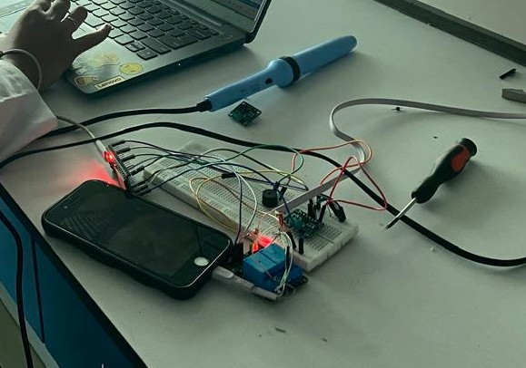
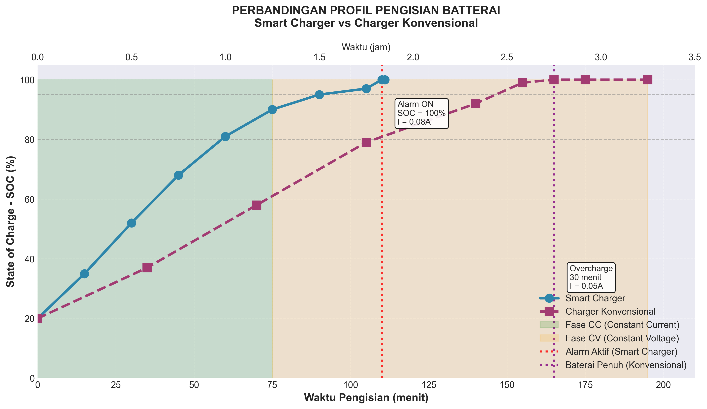

# IoT Smart Charger With Alarm Prototype

## Overview

This project presents an IoT-based smart charger prototype developed using ESP32. The system monitors charging parameters in real time, including voltage and current, and provides an alert when the charging process is complete.

## Project Background

Conventional charging methods often provide limited information regarding charging status and performance. This project aims to improve charging monitoring by integrating real-time sensing and notification features, allowing users to better track the charging process.

## Features

- Real-time voltage monitoring
- Real-time current monitoring
- Charging completion notification using a buzzer
- ESP32-based implementation
- Charging performance analysis and comparison with conventional charging methods

## Technologies Used

- ESP32
- Arduino IDE
- C/C++
- IoT-based monitoring
- Voltage and current sensors

## My Contributions

- Hardware design and assembly
- Sensor integration
- ESP32 programming
- Data collection and testing
- Performance analysis and visualization

## Prototype



## Results

### Charging Performance Analysis



The prototype successfully monitored charging parameters and provided notifications when charging was completed. Experimental results were analyzed and compared against conventional charging methods to evaluate charging efficiency and system performance.

## Repository Structure

```text
├── arduino/
│   └── chargerfix.ino
├── images/
│   ├── hardware.jpeg
│   └── soc_vs_time_detailed.png.png
├── README.md
└── .gitignore
```

## Future Improvements

- Mobile application integration
- Cloud-based data storage
- Real-time dashboard visualization
- Battery health prediction using machine learning

## Author

Annisa Primahapsari
